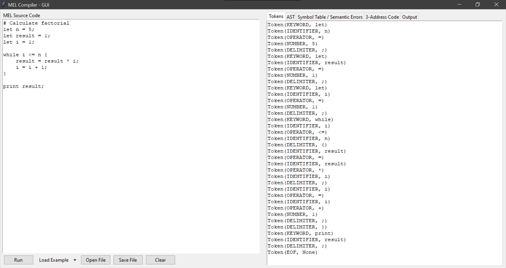

# MEL Compiler (Mathematical Expression Language)

A fully functional **MEL (Mathematical Expression Language) Compiler** built in Python as part of my Compiler Construction course.  
It implements all major phases of a modern compiler—**Lexical Analysis, Parsing, Semantic Analysis, Intermediate Code Generation, and Interpretation**—along with a complete **GUI built using Tkinter**.

---

## 🚀 Features

### ✅ Compiler Phases
- **Lexical Analysis**  
  Tokenizes keywords, identifiers, numbers, operators, delimiters, and comments.

- **Syntax Analysis (Parser)**  
  Builds an Abstract Syntax Tree (AST) supporting:
  - Variable declarations  
  - Assignments  
  - Arithmetic expressions  
  - Comparison operators  
  - `if-else` blocks  
  - `while` loops  
  - `print` statements  

- **Semantic Analysis**  
  Checks:
  - Undeclared variables  
  - Redeclarations  
  - Type consistency  

- **Intermediate Code Generation (3AC)**  
  Produces three-address code using temporary variables and labels.

- **Interpreter**  
  Executes the AST and produces final program output.

---

## 🖥️ GUI (Tkinter)

The project includes a full graphical interface where you can:

- Write and run MEL programs  
- Load example programs (Factorial, Fibonacci, Conditional statements)  
- View:
  - Tokens  
  - AST (JSON format)  
  - Symbol table + semantic errors  
  - Three-address code  
  - Output of the program  

---

## 🖼️ GUI Output Preview



---
## 📌 Example MEL Program

```
let n = 5;
let result = 1;
let i = 1;

while i <= n {
    result = result * i;
    i = i + 1;
}

print result;
```

---

## 📦 Installation

```bash
git clone https://github.com/HussainS5/Compiler-Construction-Project---MEL-Compiler-with-GUI
cd <repo-folder>
python MELCompiler.py
```

No external dependencies other than Python's standard library.

---

## 🛠️ Technologies Used

- **Python 3**
- **Tkinter** (GUI)
- **OOP-based compiler design**

---

## 📁 Project Structure

```
MELCompiler.py        # Full compiler + GUI
Output_UI.png        #Ouput of the program
README.md            # Documentation
```

---

## 🎯 Purpose

This project was created to demonstrate practical compiler construction concepts by building a custom language from scratch with full compiler phases and an interactive GUI.

---
